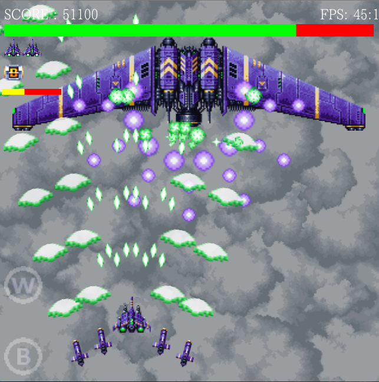

PlanetBuster2
=============

弾幕STG

以前作成したPlanetBusterの完全版です。
開発中の為、２ステージのみとなります。

タイトルで難易度を選択できます。
左右キーまたはクリップかタップして難易度を選択してください。
クリックかタップの場合は
NORMAL>HARD>EASY>NORMAL
とループします。

操作方法
画面をドラッグまたはスワイプで自機の移動。
弾はオートで発射されます。
Ｚキーまたは左下のＢボタンでボム投下。
Ｘキーまたは左下のＷボタンでサブウェポン使用（取得時のみ）

詳細はチュートリアルを参照してください。

ゲームオーバー時にSEND SCOREを選択するか、タイトルのメニューでendを選択すると9leapにスコアを登録します。
スコアランキング上は同じスコアでも難易度が高い方が上位となります。

このゲームは以下のサイトの素材を利用させて頂いております。

HamCorossam
http://homepage2.nifty.com/hamcorossam/
フリー効果音 On-Jin ～音人～
http://www.yen-soft.com/ssse/
音楽素材/魔王魂
http://maoudamashii.jokersounds.com/
フリー音楽素材 煉獄庭園
http://www.rengoku-teien.com/

